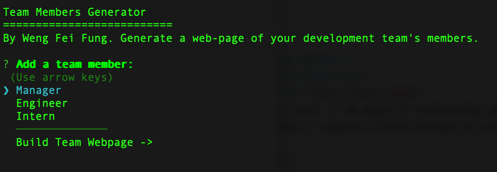
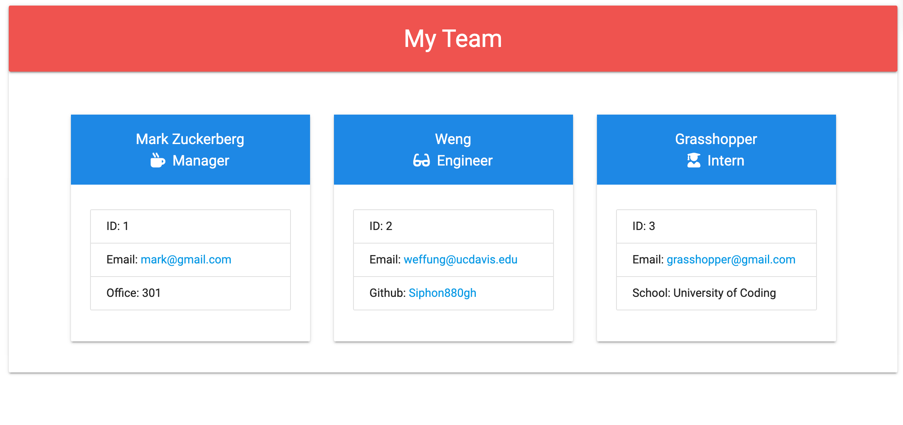

Team Members Generator
===
By Weng Fei Fung. Generate a web-page of your development team's members.

Usage
===
Run ```node index.js``` and answer question prompts.

Screenshots
===
Generator tool:


Example of what gets generated:
